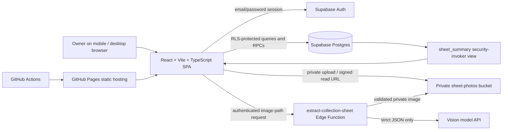
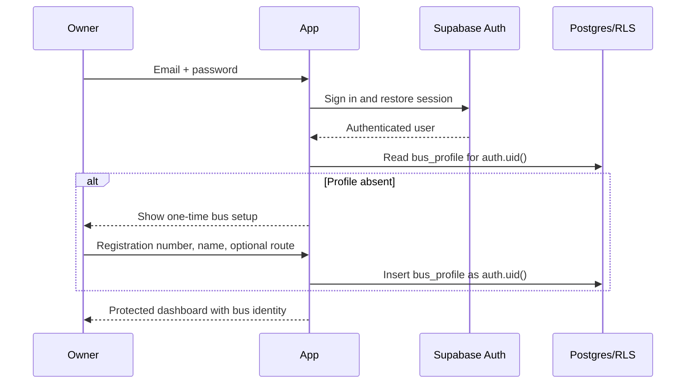

# BusLedger MVP — Execution Plan

## 1. Objective and delivery boundary

Build a mobile-first, light-theme React web application for **one authenticated owner and one bus**. The owner photographs a daily collection sheet, reviews every OCR value, saves one verified sheet for the selected date, and views reliable monthly operating reports.

This plan deliberately excludes all PRD out-of-scope features: multi-bus management, off-sheet expenses, fixed-cost profit calculations, staff accounts, public signup, notifications, exports, Malayalam UI, native apps, and OCR auto-save/bulk processing.

**Definition of success:** the owner can correct a scanned sheet and save it once; the source photo stays private and viewable; monthly totals, charts, missing dates, and mismatch indicators come from protected database summaries—not client-only calculations.

## 2. Decisions to resolve before implementation

The implementation can start on the foundation while these are confirmed, but they should be resolved before UI navigation and production OCR testing.

| Item | PRD observation | Recommended resolution |
| --- | --- | --- |
| Bottom navigation | Section 7 specifies both a three-part Home / Scan / Current month navigation and a four-destination Home / Scan / Current month / Menu navigation. | Use **four destinations**: Home, central Scan, selected-month Records, and Menu. It is the later, more detailed direction; Reports remain reachable from Home’s Monthly report tile and Menu. |
| Reference photo fixture | The PRD gives the reference values but does not include the actual sheet image. | Obtain a consented/redacted image in a non-public test fixture. Keep a mocked extraction response for deterministic browser tests; run the real image as an opt-in integration check. |
| Production owner provisioning | Public signups are disabled after the owner exists, but the initial owner-creation process is unspecified. | Create the owner in the Supabase dashboard/admin flow once; document this in the README. The app exposes login, reset password, and logout only. |
| OCR provider/model | A vision API is required but not named. | Choose and document a model with JSON-schema/structured-output support. Store provider key and model name exclusively as Edge Function secrets. |

## 3. Target architecture



### 3.1 Client architecture

Use React, Vite, TypeScript, Tailwind CSS, `HashRouter`, Recharts, `vite-plugin-pwa`, Vitest, and Playwright. Keep dependencies small; use custom hooks and typed Supabase helpers rather than introducing a state-management framework unless a concrete need emerges.

```text
src/
  components/       # shell, nav, form controls, currency, feedback states, charts
  hooks/            # auth, bus profile, sheet draft, monthly data, signed-photo URL
  lib/              # Supabase client, money/date/validation/image/OCR utilities
  pages/            # auth, setup, home, scan, review steps, records, detail, reports, settings
  types/            # database, domain and OCR-draft types
  strings.ts        # every visible English UI string
  App.tsx
  main.tsx
supabase/
  migrations/0001_init.sql
  functions/extract-collection-sheet/index.ts
tests/              # unit, browser helpers and test fixtures
.github/workflows/deploy.yml
```

Routes are hash-based so GitHub Pages refreshes do not produce 404s:

| Route | Access | Purpose |
| --- | --- | --- |
| `#/login`, `#/forgot-password`, `#/reset-password` | Public | Owner access and recovery |
| `#/setup` | Authenticated, no profile | One-time bus profile creation |
| `#/` | Authenticated + profile | Home dashboard and selected-month summary |
| `#/scan` and `#/review/:draftId/:step` | Authenticated + profile | Photo intake and 3-step review |
| `#/records/:year/:month`, `#/sheets/:id` | Authenticated + profile | Sheet history and detail/edit/delete |
| `#/reports/:year/:month` | Authenticated + profile | Monthly reports |
| `#/settings` | Authenticated + profile | Edit the sole bus profile and sign out |

### 3.2 Data and security architecture

All schema, RLS, storage policies, views, functions, grants, constraints, indexes, and triggers belong in `supabase/migrations/0001_init.sql`.

| Object | Responsibility | Key safeguards |
| --- | --- | --- |
| `bus_profile` | Exactly one configured bus per owner | `owner_id` primary key; RLS owner-only |
| `daily_sheets` | Verified daily collection record and private photo key | `(owner_id, sheet_date)` unique; integer checks; `entry_source = 'scan'`; RLS owner-only |
| `sheet_expenses` | Normalized named expenses and repeatable `others` rows | category check; non-negative amount; cascading parent deletion; ownership verification |
| `sheet_summary` | Per-sheet collection, expense total, balance, and mismatch flags | `security_invoker = true`; expense sums use `COALESCE`; no RLS bypass |
| Report RPCs/views | Database-derived monthly totals, categories, daily series, and mismatch list | authenticated, scoped to `auth.uid()` and queried from `sheet_summary` / `sheet_expenses` |
| `save_daily_sheet` RPC | Insert/update a sheet and replace all its expense rows atomically | validates caller, payload, IDs, path, categories, integer amounts, future date and duplicate date conflict |
| `sheet-photos` Storage bucket | Original JPEG evidence | private bucket; object path policy requires the first path segment to equal `auth.uid()` |

Implementation details for the migration:

- Use UUID primary keys with `gen_random_uuid()`, timestamps, an `updated_at` trigger, and useful indexes on `(owner_id, sheet_date)` and `sheet_expenses(sheet_id)`.
- Have the client generate a UUID for a new sheet **before** upload. Its photo path is exactly `{auth.uid()}/{sheetId}.jpg`; the save RPC checks that this exact pattern is supplied. This makes a private upload possible before a saved database row exists.
- Use one typed JSONB input for the sheet and expense payload in `save_daily_sheet`. It must reject fractional, negative, missing-required, unknown-category, and non-owner values. Empty standard expenses are normalized to zero and omitted from stored rows; multiple `others` values remain separate rows.
- Return a machine-readable duplicate conflict that includes the existing sheet ID only when it belongs to the caller, allowing **Edit existing sheet**.
- `written_total` produces a total mismatch only when present and different from computed expenses. `written_balance` produces a balance mismatch only when present and different from `collection - total_expense`.
- Keep public direct table access limited by RLS. The transactional RPC may be `SECURITY DEFINER` only with explicit `auth.uid()` ownership checks, a fixed `search_path`, minimal grants, and no trust in client-supplied `owner_id`.
- Create Storage policies for `select`, `insert`, `update`, and `delete` only in `sheet-photos` where `storage.foldername(name)[1] = auth.uid()::text`. Photo display always obtains a short-lived signed URL.
- Photo replacement uploads the new private image first, updates the sheet through the RPC, then removes the old object. Delete uses an authenticated cleanup path that removes both the record and private object; failures must surface and be retried/cleaned rather than being reported as successful.

### 3.3 OCR boundary

`extract-collection-sheet` is a read-only, authenticated Edge Function—not a financial write path.

1. It validates the bearer JWT and receives only a private image path.
2. It verifies the path begins with the caller’s user ID and matches an image that user is allowed to reference.
3. It reads the private image server-side, checks type/size, and invokes the configured vision model with the fixed collection-sheet schema.
4. It validates model output against a server-side schema and normalizes money values to whole integers or `null`.
5. It returns a typed draft: header fields, standard expenses, repeatable `others` amount/note pairs, collection, paper total/balance, per-field confidence, and `needsReview` flags.
6. It never calls a data-mutating database API. Model, timeout, network, and malformed-output failures return actionable errors while leaving the manually editable draft available.

The prompt must map only known printed rows, require JSON, prohibit invented values, preserve `Others` wording as its note, and mark any uncertain/missing field for review. Keys and model name are Edge Function secrets, never Vite variables or repository files.

### 3.4 Privacy-aware PWA behavior

Cache only the public app shell/static assets. Do not cache Supabase API responses, bearer-authenticated requests, signed photo URLs, or sheet images for offline reuse. Show an offline state and prevent/clearly fail attempted saves; do not claim an offline save completed.

## 4. Core workflows

### 4.1 First sign-in and bus setup



### 4.2 Scan, review, and atomic save

```mermaid
sequenceDiagram
  participant Owner
  participant App
  participant Storage as Private Storage
  participant OCR as Edge Function
  participant DB as save_daily_sheet RPC
  Owner->>App: Take photo or select image
  App->>App: Validate, rotate, strip metadata, JPEG compress (about 1600px / 0.7)
  App->>Storage: Upload {ownerId}/{newSheetId}.jpg
  App->>OCR: Authenticated request with private path
  OCR-->>App: Draft + confidence/needs-review (no DB mutation)
  App-->>Owner: 3-step ledger review with original thumbnail
  Owner->>App: Correct values and tap Save sheet
  App->>App: Client validation and calculated preview
  App->>DB: One insert/update + expense replacement transaction
  alt Duplicate date
    DB-->>App: Existing owned sheet ID conflict
    App-->>Owner: Sheet already exists / Edit existing sheet
  else Valid save
    DB-->>App: Saved sheet summary
    App-->>Owner: Confirmation and detail/history
  else Network or DB failure
    DB-->>App: Error; nothing partially saved
    App-->>Owner: Clear retry state; keep entered draft
  end
```

Review steps retain an in-memory draft while moving between **Sheet details**, **Expenses**, and **Review & Save**. All numeric inputs use numeric input mode, accept non-negative whole rupees except optional `written_balance` (which may be negative), and show calculated totals in a sticky summary. A mismatch warning is neutral and never prevents saving.

### 4.3 Edit, replacement, and deletion

1. Open a history row; fetch its protected data and a short-lived signed image URL.
2. Edit in the same review flow. Save calls the same atomic RPC with the existing sheet ID and replaces expense rows in that transaction.
3. For photo replacement, fully upload the new image first; only then point the verified record at it and remove the old photo. Keep a recoverable cleanup record/retry path if object cleanup fails.
4. For deletion, require confirmation, delete the owned data and related object through an authenticated, ownership-checked path, invalidate report/history caches, and show success only when both resources are removed (or report a retriable cleanup error).

### 4.4 Monthly reporting

1. Owner selects a month on Home, Records, or Reports.
2. The client requests database-derived monthly summary, daily summary rows, expense-category totals, diesel series, mismatch records, and existing sheet dates.
3. The client renders Indian-grouped currency, bars/line chart, expense breakdown, calendar, and list views without recomputing persisted dashboard totals.
4. Missing dates are formed from the selected month’s elapsed dates minus saved dates; never include dates after today, and never include dates after the end of the selected month.

## 5. Execution backlog

Each phase ends with a focused commit, relevant tests, and `npm run build`. Do not start the next phase until its exit criteria pass.

### Phase 0 — Repository and product guardrails

- [ ] Inspect the existing repository, package manager, Git status, and any existing implementation without overwriting user changes.
- [ ] Confirm the four navigation choices and provision/obtain the reference-photo fixture decisions in Section 2.
- [ ] Create `.env.example` containing only `VITE_SUPABASE_URL`, `VITE_SUPABASE_ANON_KEY`, and `VITE_BASE=/`; ensure actual `.env*` secrets are ignored.
- [ ] Add a README covering local prerequisites, Supabase migration/deployment, owner provisioning, Edge Function secrets, test commands, and GitHub Pages variables.

**Exit:** scope is documented, no secret can enter the frontend bundle, and unresolved product choices are explicitly recorded.

### Phase 1 — App foundation, design system, and secure database

**Status (2026-10-01):** Application foundation implemented and locally verified (`npm test`, lint, production build, and 360px visual check). Applying the migration and validating RLS against a real Supabase project remain pending project configuration.

- [ ] Scaffold/configure Vite + React + TypeScript + Tailwind, `HashRouter`, strict TypeScript, linting, Vitest, Playwright, Recharts, and PWA support.
- [ ] Set `base: process.env.VITE_BASE ?? '/'` (via Vite env handling) and prove hash routing works in a production build.
- [ ] Create the responsive light-only shell: wordmark, desktop expansion, 44px targets, 16px editable text, navy headings, `#0866FF` primary actions, dividers, accessible focus styles, and centralized `src/strings.ts`.
- [ ] Create `0001_init.sql` with tables, constraints, categories, indexes, timestamp trigger, RLS, Storage bucket/policies, `sheet_summary`, report queries/RPCs, and `save_daily_sheet`.
- [ ] Add typed Supabase client and generated/maintained database TypeScript types; centralize money formatting (`en-IN`, `INR`, whole rupees), date handling, and error translation.
- [ ] Apply migration to a local/dev Supabase project and verify policies with SQL/API tests using two users.

**Exit:** unauthenticated/cross-user reads and writes fail; owner-only paths work; the app builds and its shell is usable at 360px and desktop widths.

### Phase 2 — Authentication and one-bus setup

**Status (2026-10-01):** Implemented locally and verified through lint, unit tests, production build, and a 360px configuration-state visual check. Live sign-in, reset email, and profile persistence require the pending Supabase project configuration.

- [ ] Implement login, logout, password reset, session restoration, auth loading/error states, and protected-route redirect behavior.
- [ ] Implement one-time setup for registration number, display name, optional route; after setup, route to Home.
- [ ] Implement Settings as the only profile editing surface—no bus list, switcher, or creation action after the first profile.
- [ ] Put bus identity in the header and make it available to all protected pages.
- [ ] Test expired session, password-reset link routing, profile-absent route guard, and RLS ownership of profile updates.

**Exit:** an authenticated owner can create and edit exactly one profile, while a logged-out visitor cannot open protected screens.

### Phase 3 — Image intake, OCR draft, and review experience

- [ ] Build a mobile camera/gallery chooser; client-validate MIME type and file size before processing.
- [ ] Implement EXIF orientation correction, metadata removal where feasible, JPEG compression near 1600px wide/0.7 quality, progress/cancel/error states, and private upload using a pre-generated sheet UUID.
- [ ] Implement/deploy `extract-collection-sheet`; add server-side schema validation, strict prompt/schema, secret configuration, timeout/error normalization, and no database mutation.
- [ ] Define a `CollectionSheetDraft` type with every PRD field, `null` versus zero semantics, confidence, and `needsReview` per readable field.
- [ ] Build the three review steps in paper order; preserve draft state between steps; show image thumbnail/expand action; support typed completion after OCR failure.
- [ ] Build repeatable `Others` rows, optional staff names and owner note, future-date prevention, required collection, large numeric inputs, sticky calculated total/balance, and neutral mismatch copy.
- [ ] Use mocked extraction in browser tests and run the agreed reference fixture as a controlled integration check.

**Exit:** no OCR result is persisted automatically; a valid scanned photo always leads to an editable review draft, including when extraction is partial or unavailable.

### Phase 4 — Trusted persistence and sheet lifecycle

- [ ] Connect review submit to `save_daily_sheet`; disable double submit and retain the draft on failure.
- [ ] Map RPC validation and duplicate errors to clear UI, including **Sheet already exists** and **Edit existing sheet**.
- [ ] Implement month-filtered history, date-sorted rows, empty/loading/error states, quiet mismatch indicator, signed-photo detail view, and edit flow.
- [ ] Implement edit, photo replacement, and confirmation-protected deletion with verified private-photo cleanup and report refresh.
- [ ] Test the reference values end-to-end: expense total `₹9,020`, daily balance `₹3,350`, and `₹80` paper-total mismatch warning for `₹9,100`.

**Exit:** a sheet and its expenses are never partially saved, there is one record per owner/date, and its private evidence photo is correctly managed over the record lifecycle.

### Phase 5 — Home, records, reports, and accessible mobile QA

- [ ] Implement Home: greeting, bus identity, selected-month 12-month grid, today status, operating balance, supporting totals, days entered, scan action, compact calendar, recent sheets, and an empty state.
- [ ] Implement selected-month Records: header/count, date-ordered rows, and row-to-detail navigation.
- [ ] Implement Reports from database summaries: totals, days entered/days elapsed, daily collection bars, category breakdown, diesel/day line, missing dates, mismatch count/link.
- [ ] Implement the selected navigation decision: Home, prominent Scan, selected-month Records, and Menu drawer with profile, calendar, help/support, and logout; ensure report access remains obvious.
- [ ] Test keyboard navigation, labels, errors announced to assistive tech, contrast, target sizes, 360px viewport, slow-network states, and no hover-only control.

**Exit:** all report figures agree with database summary responses, missing dates exclude future dates, and primary tasks fit a phone-width layout.

### Phase 6 — Quality, deployment, and release verification

- [ ] Add unit tests for validation, date boundaries, money formatting/parsing, totals, mismatch logic, draft mapping, and missing-date calculation.
- [ ] Add database/RLS integration tests: anonymous denial, user A/B isolation for all tables and storage objects, child-row ownership, private signed-URL access, and secure RPC behavior.
- [ ] Add Playwright flows for authentication guarding, one-time setup, scan mock/review/edit/save, duplicate date handling, edit/delete confirmation, reports, 360px usability, and hash-route refresh.
- [ ] Configure GitHub Actions to install, test, build with `VITE_BASE=/<repo-name>/`, and deploy the generated static site to GitHub Pages. Supply only the public Supabase URL/anon key as repository variables/secrets appropriate to the workflow.
- [ ] Run real-device/mobile-browser smoke tests: camera/gallery choice, image rotation, review navigation, sign-out, signed-photo display, and deployed refresh.
- [ ] Perform a final security review: no service-role or vision key in repository/build, bucket is private, all table policies are enabled, views use `security_invoker`, and no UI claims an unconfirmed offline save.

**Exit:** tests and build pass, the GitHub Pages deployment refreshes successfully, the acceptance checklist below passes, and phase commits are present.

## 6. Acceptance traceability

| PRD acceptance item | Implementation evidence |
| --- | --- |
| OCR maps reference fields | Strict schema + fixture integration check + editable draft test |
| ₹9,020 expense / ₹3,350 balance | `sheet_summary` query + unit/E2E reference-value assertion |
| ₹80 mismatch still saves | mismatch component + persisted save E2E test |
| Duplicate date handled | unique constraint + RPC conflict + duplicate-flow E2E test |
| Dashboard is database-driven | report RPC/view contract tests; no persisted-total client calculation |
| Charts reflect saved month | monthly report integration/browser tests |
| Missing dates are past-only | pure date unit tests plus report E2E test |
| Privacy and isolation | RLS + Storage two-user integration tests |
| OCR never auto-saves | Edge Function code review + interception/browser test |
| 360px usable | Playwright mobile viewport and manual touch-target QA |
| Tests/build pass | CI-required checks |
| GitHub Pages refresh works | deployed hash-route smoke test |

## 7. Delivery risks and mitigations

| Risk | Mitigation |
| --- | --- |
| Handwriting OCR is inconsistent | Treat OCR strictly as a draft, identify uncertainty visibly, retain manual entry, and test against an agreed real fixture. |
| Orphan temporary images after cancel/failure | Track draft IDs; remove them on cancel, retry failed cleanup, and periodically identify unreferenced private objects through an authenticated maintenance path. |
| Database/photo operation cannot be globally transactional | Upload replacement first; use ownership-checked lifecycle operations, retries, and explicit success only after both DB and Storage operations finish. |
| GitHub Pages base-path/refresh regression | Use `HashRouter`, configurable `VITE_BASE`, and a deployed refresh test. |
| Accidental disclosure through PWA cache | Cache static shell only; keep private responses and signed photos network-only. |
| Scope creep | Treat Section 4 of the PRD as a hard exclusion checklist at every phase review. |

## 8. Final release checklist

- [ ] Every English UI string is centralized in `src/strings.ts`.
- [ ] Exactly one bus profile is possible per owner; no multi-bus UI or routes exist.
- [ ] Every saved sheet has a scanned private photograph and has been explicitly reviewed.
- [ ] All money is stored as integer rupees and shown with Indian grouping.
- [ ] All monthly persisted figures originate from protected database summaries/RPCs.
- [ ] RLS is enabled and verified for tables and private Storage objects.
- [ ] No secret is exposed to the browser bundle or source repository.
- [ ] Unit tests, RLS/storage tests, Playwright tests, and `npm run build` pass.
- [ ] The deployed app works at 360px, uses hash routes after refresh, and meets the PRD acceptance tests.
